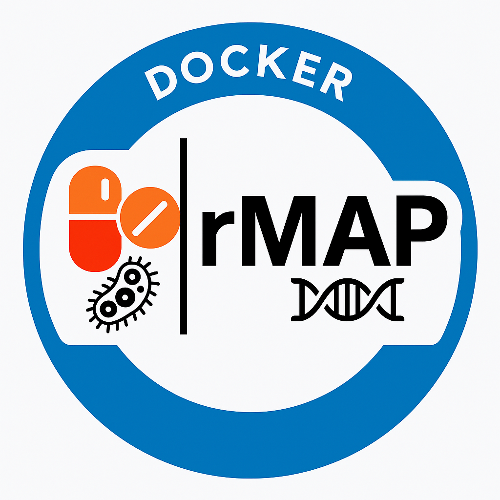

# rMAP-docker
This Docker image provides a ready-to-use environment for rMAP, a bioinformatics pipeline for analyzing microbial genomic data &amp; profiling AMR, Mobilome &amp; Virulome. It includes all required tools &amp; dependencies, enabling reproducible, scalable analysis of NGS data in research &amp; public health settings, particularly for low-resource environments.

# rMAP: Rapid Microbial Analysis Pipeline



**rMAP** is a fully automated pipeline for profiling the resistome and other genomic features of ESKAPE pathogens using whole-genome sequencing (WGS) paired-end reads.

---

## Features

- Quality control of raw sequencing reads
- Trimming of adapters & low-quality bases
- De novo assembly of genomes
- Genome annotation (Prokka)
- Detection of antimicrobial resistance genes (AMR)
- Variant calling & SNP analysis
- Phylogenetic tree construction (IQ-TREE)
- Pangenome analysis (Roary)
- Mobile Genetic Element (MGE) profiling
- SRA data download support

---

## Docker image

The Docker image is hosted on [DockerHub](https://hub.docker.com/r/gmboowa/rmap):

```bash

docker pull gmboowa/rmap:1.0

docker run -it --rm gmboowa/rmap:1.0

```

---

## Usage

```bash

rMAP [options] --input <DIR> --output <OUTDIR> --reference <REF>

```

### Required options:
- `-i/--input`     Path to input raw reads (.fastq or .fastq.gz)
- `-o/--output`    Path to output directory
- `-r/--reference` Reference genome in `.gbk` format

### Optional:
- `-q/--trim`      Trimming quality threshold (default: 27)
- `-a/--assembly`  Assembly tool: `shovill` or `megahit`
- `-m/--amr`       Perform AMR profiling
- `-vc/--varcall`  Perform variant calling
- `-p/--phylogeny` Perform phylogenetic tree construction
- `-s/--pangenome` Perform pangenome analysis

---

## Authors

- [Gerald Mboowa](https://github.com/gmboowa)
- [Ivan Sserwadda](https://github.com/GunzIvan28)
- [Stephen Kanyerezi](https://github.com/Kanyerezi30)

---

## Resources

- GitHub: [https://github.com/GunzIvan28/rMAP](https://github.com/GunzIvan28/rMAP)
- Issues: [https://github.com/GunzIvan28/rMAP/issues](https://github.com/GunzIvan28/rMAP/issues)

---

## License

This project is licensed under the MIT License. See the LICENSE file for details.

