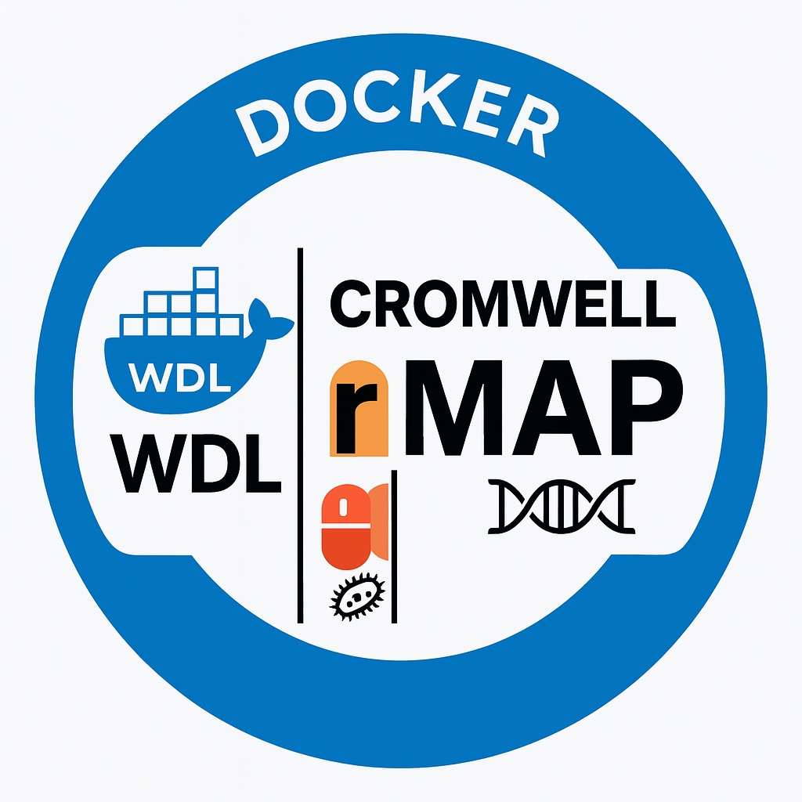

# rMAP-WDL-Cromwell-Docker
This Docker image provides a ready-to-use environment for rMAP, a bioinformatics pipeline for analyzing microbial genomic data &amp; profiling AMR, Mobilome &amp; Virulome. It includes all required tools &amp; dependencies, enabling reproducible, scalable analysis of NGS data in research &amp; public health settings, particularly for low-resource environments.


**rMAP** is a fully automated pipeline for profiling the resistome & other genomic features of ESKAPEE (*Enterococcus faecium*, *Staphylococcus aureus*, *Klebsiella pneumoniae*, *Acinetobacter baumannii*, *Pseudomonas aeruginosa*, *Enterobacter* species & *Escherichia coli*) pathogens using whole-genome sequencing (WGS) paired-end reads.

---

## Features

- Quality control of raw sequencing reads
- Trimming of adapters & low-quality bases
- *De novo* assembly of genomes
- Genome annotation (Prokka)
- Detection of antimicrobial resistance genes (AMR)
- Variant calling & SNP analysis
- Phylogenetic tree construction (IQ-TREE)
- Pangenome analysis (Roary)
- Mobile Genetic Element (MGE) profiling
- SRA data download support

---

# rMAP-WDL-Cromwell-Docker

**Version:** 1.0  
**Pipeline Type:** WDL-based, Docker-enabled  
**Workflow Engine:** Cromwell

## Overview
**rMAP-WDL-Cromwell-Docker** is a containerized, modular, and scalable workflow for microbial genomics that integrates trimming, quality control, de novo assembly, annotation, variant calling, MLST typing, AMR profiling, mobile genetic element analysis, pangenome analysis, phylogeny, and reporting.

This pipeline is written in **Workflow Description Language (WDL)**, utilizes **Docker containers** for tool standardization, and is designed to run on the **Cromwell execution engine**.

## Features
- Adapter trimming with Trimmomatic
- FastQC-based quality control
- Megahit-based genome assembly
- Prokka for genome annotation
- Snippy for variant calling
- SnpEff for variant annotation
- MLST profiling
- Roary for pangenome construction
- FastTree for phylogenetic inference
- Abricate for AMR profiling
- mob-suite for MGE detection
- Remote BLAST support to NCBI
- Auto-generated final report

---

## Requirements
- **Cromwell** (v84 or newer)
- **Docker** installed and running
- Input data: Paired-end FASTQ files
- Reference genome (FASTA)
- Adapter sequence file (FASTA or TXT)

---



## How to Download and Run

### Step 1: Clone the Repository
```bash
git clone [https://github.com/gmboowa/rMAP-WDL-Cromwell-Docker.git]
cd rMAP-WDL-Cromwell-Docker
```

### Step 2: Prepare Inputs

Edit the input JSON file (e.g., `inputs.json`) with paths to your:
- Paired-end reads
- Reference genome (https://www.ncbi.nlm.nih.gov/datasets/genome/)
- Adapter file
- Flags for toggling steps (true/false)

## SnpEff Database References

```bash

# *Escherichia coli (K-12 substrain* with RefSeq assembly GCA_000974405)
docker run --rm -it staphb/snpeff:latest snpeff databases | grep -i Escherichia_coli_k_12_gca_000974405

# *Staphylococcus aureus subsp. aureus* (NCTC 8325)
docker run --rm -it staphb/snpeff:latest snpeff databases | grep -i Staphylococcus_aureus_subsp_aureus_nctc_8325

# *Klebsiella pneumoniae subsp. pneumoniae* (HS11286, RefSeq GCA_000240185)
docker run --rm -it staphb/snpeff:latest snpeff databases | grep -i Klebsiella_pneumoniae_subsp_pneumoniae_hs11286_gca_000240185

# *Acinetobacter baumannii* (ATCC 19606 CIP 70.34)
docker run --rm -it staphb/snpeff:latest snpeff databases | grep -i Acinetobacter_baumannii_atcc_19606_cip_70_34

# *Pseudomonas aeruginosa* (PAO1, RefSeq GCA_000006765)
docker run --rm -it staphb/snpeff:latest snpeff databases | grep -i Pseudomonas_aeruginosa_pao1_gca_000006765

# *Enterococcus faecium* (S447)
docker run --rm -it staphb/snpeff:latest snpeff databases | grep -i Enterococcus_faecium_s447

# *Enterobacter cloacae (GCA_001276405)
docker run --rm -it staphb/snpeff:latest snpeff databases | grep -i Enterobacter_cloacae_subsp_cloacae_gca_001276405

```
---
### Step 3: Run the Workflow


## Run the command

```bash
java -jar cromwell.jar run rMAP.wdl --inputs inputs.json
```

To run on a backend like SLURM or Google Cloud, configure `cromwell.conf` accordingly.

---

## Output Structure
- `trimmed/` – trimmed FASTQ files
- `qc_reports/` – FastQC reports
- `assembly/` – final contigs from Megahit
- `annotation_results/` – Prokka annotations
- `mlst_results/` – MLST profiles
- `variants/` – VCFs from Snippy
- `annotated_vcfs/` – SnpEff output
- `amr_results/` – AMR gene matches
- `mge_results/` – MGE prediction
- `pangenome_results/` – Roary files
- `phylogeny_results/` – Newick trees
- `remote_blast_results/` – BLAST XML files
- `report.txt` – consolidated plain-text report

---

## Sample Input JSON
```json
{
  "rMAP.input_reads": ["sample1_R1.fastq.gz", "sample1_R2.fastq.gz"],
  "rMAP.adapters": "adapters.fa",
  "rMAP.reference_genome": "ref_genome.fasta",
  "rMAP.snpeff_organism": "gnmKlebsiella_pneumoniae_subsp_pneumoniae_HS11286",
  "rMAP.do_trimming": true,
  "rMAP.do_quality_control": true,
  "rMAP.do_assembly": true,
  "rMAP.do_variant_calling": true,
  "rMAP.do_annotation": true,
  "rMAP.do_amr_profiling": true,
  "rMAP.do_mlst": true,
  "rMAP.do_pangenome": false,
  "rMAP.do_phylogeny": true,
  "rMAP.do_mge_analysis": true,
  "rMAP.do_reporting": true,
  "rMAP.do_blast": true,
  "rMAP.assembler": "megahit",
  "rMAP.blast_db": "nt",
  "rMAP.blast_max_target_seqs": 250,
  "rMAP.blast_evalue": 0.000001
}
```

---

## Tools Used (with Docker Images)
| Step                | Tool          | Docker Image                          |
|---------------------|---------------|----------------------------------------|
| Trimming            | Trimmomatic   | `staphb/trimmomatic:0.39`             |
| QC                  | FastQC        | `staphb/fastqc:0.11.9`                |
| Assembly            | Megahit       | `quay.io/biocontainers/megahit:1.2.9` |
| Annotation          | Prokka        | `staphb/prokka:1.14.6`                |
| Variant Calling     | Snippy        | `staphb/snippy:4.6.0`                 |
| Variant Annotation  | SnpEff        | `staphb/snpeff:latest`                |
| MLST                | MLST          | `staphb/mlst:2.19.0`                  |
| Pangenome           | Roary         | `staphb/roary:3.13.0`                 |
| Phylogeny           | FastTree      | `staphb/fasttree:2.1.11`              |
| AMR Profiling       | Abricate      | `staphb/abricate:1.0.0`               |
| MGE Analysis        | mob-suite     | `continuumio/miniconda3:latest`       |
| Remote BLAST        | BLAST+        | `ncbi/blast:2.14.0`                   |


---

## Authors & Contributors

- [Gerald Mboowa](https://github.com/gmboowa)
- [Ivan Sserwadda](https://github.com/GunzIvan28)
- [Stephen Kanyerezi](https://github.com/Kanyerezi30)


## Resources

- GitHub: [https://github.com/GunzIvan28/rMAP](https://github.com/GunzIvan28/rMAP)
- Issues: [https://github.com/GunzIvan28/rMAP/issues](https://github.com/GunzIvan28/rMAP/issues)

---

## License

This project is licensed under the MIT License. See the LICENSE file for details.

