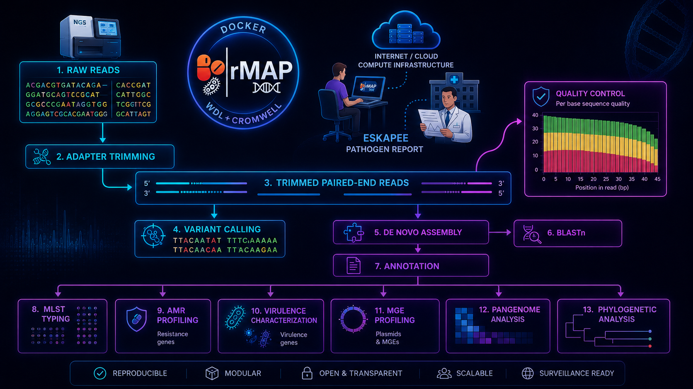

# rMAP-2.0

This modular tool provides a ready-to-use environment for **rMAP-2.0**, a bioinformatics pipeline for analyzing microbial genomic data & profiling **AMR**, **Mobilome**, **Virulome** & **Phylogenomics** with support for **MLST typing**, **variant calling**, **BLASTn-based** sequence similarity search,. It includes all required tools & dependencies, enabling reproducible, scalable analysis of NGS data in research & public health settings.

**rMAP-2.0** is a fully automated pipeline for profiling the resistome & other genomic features of ESKAPEE (*Enterococcus faecium*, *Staphylococcus aureus*, *Klebsiella pneumoniae*, *Acinetobacter baumannii*, *Pseudomonas aeruginosa*, *Enterobacter* species & *Escherichia coli*) pathogens using whole-genome sequencing (WGS) paired-end reads.

---

## Table of contents

- [Overview](#overview)
- [Features](#features)
- [Quick start / Test dataset (E. coli, Illumina PE)](#quick-start--test-dataset-e-coli-illumina-pe)
- [Prerequisites](#prerequisites)
- [Install / download](#install--download)
- [How to run](#how-to-run)
  - [Step 1: Prepare inputs](#step-1-prepare-inputs)
  - [Step 2: Run the workflow](#step-2-run-the-workflow)
  - [Configuration guidance](#configuration-guidance)
  - [Quality score options](#quality-score-options)
- [Minimum sample requirements](#minimum-sample-requirements)
- [Sample input JSON](#sample-input-json)
- [Tools used (with Docker images)](#tools-used-with-docker-images)
- [Outputs](#outputs)
  - [Cromwell output structure (actual)](#cromwell-output-structure-actual)
  - [Example of outputs by modules](#example-of-outputs-by-modules)
  - [Report visualization](#report-visualization)
- [Databases (local BLAST + updates)](#databases-local-blast--updates)
  - [Prebuilt ESKAPEE reference database (Zenodo)](#prebuilt-eskapee-reference-database-zenodo)
  - [Build a local ESKAPEE BLAST database from RefSeq](#build-a-local-eskapee-blast-database-from-refseq)
  - [Build from a curated local FASTA](#build-from-a-curated-local-fasta)
  - [Index custom nucleotide databases (AMR / plasmid / virulence)](#index-custom-nucleotide-databases-amr--plasmid--virulence)
  - [Database refresh cadence and reproducibility](#database-refresh-cadence-and-reproducibility)
  - [Notes on BLAST usage](#notes-on-blast-usage)
- [Benchmarking](#benchmarking)
  - [Hosted example reports](#hosted-example-reports)
- [HPC / cloud execution (Cromwell backends)](#hpc--cloud-execution-cromwell-backends)
  - [Suggested configuration layout](#suggested-configuration-layout)
  - [Test commands](#Test-commands)
  - [Notes](#notes)
- [Offline use & data sovereignty](#offline-use--data-sovereignty)
- [Releases & reproducibility](#releases--reproducibility)
  - [What a GitHub Release contains](#what-a-github-release-contains)
  - [Container pinning](#container-pinning)
- [Intended use & limitations](#intended-use--limitations)
- [Docker Desktop configuration for rMAP-2.0](#docker-desktop-configuration-for-rmap-20)
- [Troubleshooting](#troubleshooting)
- [Support / Issues](#support--issues)
- [Citation](#citation)
- [Authors & contributors](#authors--contributors)
- [License](#license)
- [Acknowledgements](#acknowledgements)
- [Appendix](#appendix)

---

---
## Overview

**Version:** 1.0 (see **Releases** for tagged versions)  
**Pipeline Type:** WDL-based, Docker-enabled  
**Workflow Engine:** Cromwell  

rMAP-2.0 is a containerized, modular & scalable workflow for microbial genomics that integrates trimming, quality control, *de novo* assembly, annotation, variant calling, MLST typing, AMR profiling, mobile genetic element analysis, pangenome analysis, phylogeny & tree visualization.

The workflow is written in **Workflow Description Language (WDL)**, uses **Docker containers** for tool standardization & is designed to run on the **Cromwell execution engine**. The primary deliverable is a **single consolidated, navigable HTML report** (with per-module outputs preserved in the Cromwell execution directories).

---

## Features

- Adapter trimming with **Trimmomatic**
- Quality control using **FastQC** & **MultiQC**
- Genome assembly using **MEGAHIT**
- Genome annotation with **Prokka**
- Variant calling using **Snippy**
- **MLST** profiling for sequence typing
- **Roary** for pangenome construction
- Phylogenetic inference using **FastTree**
- AMR, virulence, & MGE detection with **Abricate**
- Sequence similarity search using **BLAST**
- Phylogenetic tree visualization with **ETE3**
- Generation of a consolidated interactive **HTML report** summarizing all key outputs

---

## Quick start / Test dataset (*E. coli*, Illumina PE)

To support reproducibility and quick validation, the repository includes a small Illumina paired-end *Escherichia coli* test dataset (5 isolates) under [`test_data/`](./test_data), together with a matching input JSON: [`test_data/inputs_test.json`](./test_data/inputs_test.json).

> The **test_data** cohort comprises five *E. coli* WGS datasets retrieved from NCBI/SRA (typical *E. coli* genome size ≈ **5.0 Mb**, with expected strain-to-strain variation).

A hosted end-to-end test HTML report generated from this dataset is available here:

- https://gmboowa.github.io/rMAP-2.0/eskapee/test_data/

### Run the workflow on the bundled test dataset

From the repository root:

```bash
# Run with Cromwell
java -jar cromwell.jar run rMAP.wdl --inputs test_data/inputs_test.json
```

### Expected outputs

After a successful run, Cromwell will write outputs under `cromwell-executions/` (plus workflow logs). Key expected outputs include:

- **QC outputs**: FastQC per-sample + MultiQC summary
- **Assembly outputs**: assembled contigs (FASTA)
- **Annotation outputs**: Prokka annotations (e.g., GFF/GBK)
- **Typing/AMR outputs**: MLST & AMR profiling results
- **Pangenome/phylogeny outputs** (multi-isolate): Roary outputs & phylogenetic trees
- **Final HTML report**: merged interactive report generated at the end of the workflow

> Note: pangenome & phylogeny are most meaningful with multiple isolates; this test dataset is provided specifically to exercise the full end-to-end workflow quickly.

---

## Prerequisites

- [**Java 17 or newer (Oracle JDK)**](https://www.oracle.com/java/technologies/downloads/#java17)
- [**Cromwell** (v84 or newer)](https://github.com/broadinstitute/cromwell/releases)
- [**Docker**](https://www.docker.com/) (installed & running)

Optional (only required if you build local databases yourself):
- **BLAST+ (for indexing local databases)**  
  Needed for building & searching local AMR, plasmid, or virulence factor databases.  
  Install via Conda:
  ```bash
  conda install -c bioconda blast
  ```

Input data:
- Paired-end FASTQ files (Illumina PE recommended)
- Reference genome (FASTA) or GenBank
- Adapter sequence file (FASTA or TXT)

---

## Install / download

### Step 1: Clone the repository

```bash
git clone https://github.com/gmboowa/rMAP-2.0.git
cd rMAP-2.0
```

### Step 2: Get Cromwell

Download `cromwell.jar` from the Cromwell releases page (or use your site-provided Cromwell).  
Place it in your working directory or provide its full path in commands below.


### Step 3: Confirm Docker is running (check allocated resources)

```bash
docker info >/dev/null && echo "Docker is running"
```

### Show Docker Desktop VM allocation for Docker

Open Docker Desktop > Go to Settings → Resources → Advanced > Move the sliders

- CPU limit → increase (e.g., 8–15 as you have)

- Memory limit → increase  (~15.8 GB, basically max for a 16 GB machine)

- Swap → optional (2–4 GB is fine)

- Disk usage limit → increase if you’re pulling large images / databases

Finally, click **Apply** (Docker may restart)

In the terminal 

docker info | egrep "CPUs|Total Memory"

---

## How to run

### Step 1: Prepare inputs

Edit your input JSON file (e.g., `inputs.json`) with paths to your:
- Paired-end reads
- Reference genome (FASTA or GenBank)
- Illumina Adapter file
- Flags for toggling steps (true/false)
- Optional database configuration (local BLAST, custom AMR/VF DBs)

### Step 2: Run the workflow

```bash
java -jar cromwell.jar run rMAP.wdl --inputs inputs.json
```

---

### Configuration guidance

- For the pipeline to execute successfully, the following tasks must be enabled at a minimum:
  - **Trimming**
  - **Assembly**
  - **Reporting**

If you disable optional modules, ensure downstream modules do not depend on them.

---

### Quality score options

rMAP uses Trimmomatic for adapter/quality trimming. By default, Trimmomatic is run with `-phred33`, which is the standard quality encoding for modern Illumina FASTQ files.

If you need flexibility (e.g., legacy data encoded as Phred+64), you can override the default via the inputs JSON parameter below:

```json
{
  "rMAP.trimmomatic_quality_encoding": "phred33"
}
```

Allowed values:
- `"phred33"` (default; recommended for Illumina FASTQ)
- `"phred64"` (legacy encoding; use only if your FASTQ is Phred+64)

If `rMAP.trimmomatic_quality_encoding` is not provided, rMAP defaults to `phred33`.

---

## Minimum sample requirements

Certain analysis modules require minimum sample numbers to function properly:

| Analysis module                                   | Minimum samples | Required for                                   | JSON parameter to disable             |
|--------------------------------------------------|-----------------|------------------------------------------------|--------------------------------------|
| **Pangenome analysis** (Roary)                   | 2               | Core/accessory genome separation               | `"rMAP.do_pangenome": false`         |
| **Phylogenetic analysis** (core/accessory trees) | 4               | Meaningful tree topology & bootstrap support   | `"rMAP.do_phylogeny": false`         |

> Tip: rMAP will still run on smaller cohorts if you disable modules that require multi-sample context.

---

## Sample input JSON

Validate JSON locally with `jq` or any JSON validator.

```bash
jq . inputs.json >/dev/null && echo "JSON OK"
```

Example JSON (update paths to your environment):

```json
{
  "rMAP.input_reads": [
    "~/sample1_R1.fastq.gz",
    "~/sample1_R2.fastq.gz",
    "~/sample2_R1.fastq.gz",
    "~/sample2_R2.fastq.gz"
  ],
  "rMAP.adapters": "~/adapters.fa",
  "rMAP.reference_genome": "~/reference.gbk",
  "rMAP.reference_type": "genbank",

  "rMAP.trimmomatic_quality_encoding": "phred33",

  "rMAP.do_trimming": true,
  "rMAP.do_quality_control": true,
  "rMAP.do_assembly": true,
  "rMAP.do_variant_calling": true,
  "rMAP.do_annotation": true,
  "rMAP.do_amr_profiling": true,
  "rMAP.do_mlst": true,
  "rMAP.do_pangenome": true,
  "rMAP.do_phylogeny": true,
  "rMAP.do_mge_analysis": true,
  "rMAP.do_virulence": true,
  "rMAP.do_reporting": true,
  "rMAP.do_blast": true,

  "rMAP.use_local_blast": true,

  "rMAP.local_blast_db": "~/eskapee_db/eskapee_db.fasta",
  "rMAP.local_amr_db": "~/resfinder.fa",
  "rMAP.local_mge_db": "~/plasmidfinder.fa",
  "rMAP.local_virulence_db": "~/vfdb.fa",

  "rMAP.blast_max_target_seqs": 250,
  "rMAP.blast_evalue": 0.000001,
  "rMAP.blast_min_contig_length": 300,

  "rMAP.virulence_min_cov": 60,
  "rMAP.virulence_min_id": 80.0,

  "rMAP.phylogeny_model": "-nt -gtr",

  "rMAP.max_cpus": 8,
  "rMAP.max_memory_gb": 16
}
```

> Important: when using local BLAST, `rMAP.local_blast_db` must point to the **BLAST database prefix** (e.g., `~/eskapee_db/eskapee_db.fasta`), **not** the FASTA file.

---

## Tools used (with Docker images)


| Step                | Tool          | Docker image                                  |
|---------------------|---------------|-----------------------------------------------|
| Trimming            | Trimmomatic   | `staphb/trimmomatic:0.39`                     |
| QC                  | FastQC        | `staphb/fastqc:0.11.9`                        |
| Assembly            | Megahit       | `quay.io/biocontainers/megahit:1.2.9--h5ca1c30_6` |
| Annotation          | Prokka        | `staphb/prokka:1.14.6`                        |
| Variant Calling     | Snippy        | `staphb/snippy:4.6.0`                         |
| MLST                | MLST          | `staphb/mlst:2.19.0`                          |
| Pangenome           | Roary         | `gmboowa/roary-pillow:0.4`                    |
| Phylogeny           | FastTree      | `staphb/fasttree:2.1.11`                      |
| Tree Visualization  | ETE3          | `gmboowa/ete3-render:1.18`                    |
| AMR/MGE/Virulence   | Abricate      | `staphb/abricate:1.0.0`                       |
| BLAST               | BLAST+        | `gmboowa/blast-analysis:1.9.4`                |

---

## Outputs

### Cromwell output structure (actual)

Cromwell typically writes outputs under:

```bash
cromwell-executions/
  rMAP/
    <workflow-id>/
      call-TRIMMING/
        execution/
        stdout
        stderr
        rc
      call-QUALITY_CONTROL/
      call-ASSEMBLY/
      ...
```

Each `call-*` directory contains:
- `execution/` – shell scripts & logs for the task
- `stdout` / `stderr` – standard output & error logs
- `rc` – return code for the task
- output files generated by the task (e.g., `.fasta`, `.vcf`, `.tsv`, `.json`, `.html`, etc.)


---

### Example of outputs from different modules

| Module                | Key output files                                                                 |
|----------------------|-----------------------------------------------------------------------------------|
| `TRIMMING`            | Trimmed FASTQ files (`*.fastq.gz`)                                                |
| `QUALITY_CONTROL`     | MultiQC report + FastQC outputs (`*.zip`, `*.html`)                               |
| `ASSEMBLY`            | Assembled contigs (`*.fasta`)                                                     |
| `VARIANT_CALLING`     | Variant calls (`*.vcf`)                                                           |
| `ANNOTATION`          | Prokka annotations (`*.gff`, `*.gbk`)                                             |
| `AMR_PROFILING`       | AMR profiles (`*.txt`, `*.tsv`)                                                   |
| `MLST`                | MLST profiles (`*.txt`, `*.tsv`)                                                  |
| `MGE_ANALYSIS`        | Plasmid/MGE predictions (`*.txt`, `*.tsv`)                                        |
| `VIRULENCE_ANALYSIS`  | Virulence gene predictions (`*.txt`, `*.tsv`)                                     |
| `BLAST_ANALYSIS`      | Top BLAST hits (`*.tsv`, `*.xml`)                                                 |
| `PANGENOME`           | Roary outputs (`gene_presence_absence.csv`, `core_gene_alignment.aln`)            |
| `CORE_PHYLOGENY`      | Core genome tree + alignment (`*.nwk`, alignments)                                |
| `ACCESSORY_PHYLOGENY` | Accessory tree (`*.nwk`)                                                          |
| `TREE_VISUALIZATION`  | Rendered trees (`*.png`, `*.pdf`)                                                 |
| `MERGE_REPORTS`       | Consolidated HTML report + assets (`final_report.html`, `assets/*`, summaries)    |

---

### Report visualization

Interactive HTML reports for several ESKAPEE example cohorts are hosted here:

- https://gmboowa.github.io/rMAP-2.0/

---

## Databases (local BLAST + updates)

rMAP-2.0 supports fully offline operation by allowing users to run against **local, versioned reference databases**. For convenience & reproducibility, we provide a **prebuilt ESKAPEE reference BLAST database snapshot** & also document how to rebuild the database from public genomes (e.g., RefSeq) when users need a customized or refreshed reference set.

---

### Prebuilt ESKAPEE reference database (Zenodo)

We distribute a ready-to-use ESKAPEE reference database snapshot via Zenodo:

Zenodo record: https://zenodo.org/records/18001238

#### Download, verify, and unpack

```bash
# 1) Download the archive from Zenodo (or via your browser)
#    Example filename (may vary): eskapee_db.tar.gz
# 2) Verify checksum (recommended; compare to the published .sha256 if provided)

sha256sum eskapee_db.tar.gz

# 3) Unpack
tar -xzvf eskapee_db.tar.gz
```

After extraction, you should see the BLAST database prefix files (e.g., `.nsq/.nin/.nhr`, etc.). Configure rMAP to use the **DB prefix** (not the FASTA), for example:

```json
{
  "rMAP.use_local_blast": true,
  "rMAP.local_blast_db": "~/eskapee_db/eskapee_db"
}
```

---

### Build a local ESKAPEE BLAST database from RefSeq

This option is useful if you:
- require local policies/curation,
- want a different assembly level filter,
- need to refresh the database on your own schedule.

#### Step 1: Create a working directory

```bash
mkdir -p ~/refseq/bacteria/eskapee
cd ~/refseq/bacteria/eskapee
```

#### Step 2: Use `ncbi-genome-download` 

Install the tool if not already installed:

```bash
pip install ncbi-genome-download

```

Download RefSeq genomes for the 7 ESKAPEE genera (example filter: complete genomes):

```bash
ncbi-genome-download bacteria   --genera "Escherichia,Klebsiella,Enterobacter,Acinetobacter,Pseudomonas,Staphylococcus,Enterococcus"   --formats fasta   --assembly-level complete   --section refseq   --output-folder eskapee_genomes
```

#### Step 3: Combine FASTA files into one multi-FASTA

```bash
find eskapee_genomes -name "*.fna.gz" -print0 | xargs -0 cat > eskapee_db.fasta.gz
gunzip -f eskapee_db.fasta.gz
```

#### Step 4: Create the BLAST database (prefix output)

```bash
makeblastdb   -in eskapee_db.fasta   -dbtype nucl   -parse_seqids   -title "ESKAPEE_DB"   -out eskapee_db
```

You should now have `eskapee_db.nsq`, `eskapee_db.nin`, `eskapee_db.nhr`, etc. Use the prefix in JSON:

```json
{
  "rMAP.use_local_blast": true,
  "rMAP.local_blast_db": "~/eskapee_db.fasta"
}
```

> If your DB is split into multiple volumes (e.g., `eskapee_db.00.nsq`), still use the common prefix path.

---

### Build from a curated local FASTA

If you maintain a curated FASTA (`eskapee_db.fasta`) from a known list of assemblies:

```bash
mkdir -p databases/blast/eskapee
cp ~/eskapee_db.fasta databases/blast/eskapee/

cd databases/blast/eskapee

makeblastdb   -in eskapee_db.fasta   -dbtype nucl   -parse_seqids   -max_file_sz 3000000000   -out eskapee_db
```

```bash
tar -czvf eskapee_db.tar.gz eskapee_db.*
sha256sum eskapee_db.tar.gz > eskapee_db.tar.gz.sha256
```

---

### Index custom nucleotide databases (AMR / plasmid / virulence)

Before running rMAP-2.0 with custom FASTA databases for AMR/plasmid/virulence detection, index each FASTA file with `makeblastdb`:

```bash
makeblastdb -in resfinder.fa      -dbtype nucl -parse_seqids
makeblastdb -in plasmidfinder.fa  -dbtype nucl -parse_seqids
makeblastdb -in vfdb.fa           -dbtype nucl -parse_seqids
```

Then point rMAP-2.0 to these FASTAs in your inputs JSON:

```json
{
  "rMAP.local_amr_db": "~/resfinder.fa",
  "rMAP.local_mge_db": "~/plasmidfinder.fa",
  "rMAP.local_virulence_db": "~/vfdb.fa"
}
```

---

### Database refresh cadence & reproducibility

To support reproducible analyses, we plan to refresh & publish reference snapshots on a defined cadence:

- **Hotfix updates:** on-demand when major upstream reference updates or critical issues are identified

---

### Notes on BLAST usage

- For large batches, using a local ESKAPEE BLAST database may require substantial disk space (tens of GB depending on scope & assembly level).
- NCBI imposes usage limits on BLAST queries from a single IP address; local databases improve throughput, reproducibility & compliance with query limits.

---

## Benchmarking 

We benchmarked rMAP-2.0 using three bacterial isolate WGS cohorts spanning increasing cohort sizes:

- **Small / test_data:** five *Escherichia coli* Illumina paired-end isolates (typical genome ≈ **5.0 Mb**)
- **Medium:** 11 *Pseudomonas aeruginosa* genomes (typical genome ≈ **6.3 Mb**)
- **Large:** 20 *Klebsiella pneumoniae* genomes (typical genome ≈ **5.5 Mb**)

The *E. coli* cohort served as the standardized, end-to-end runtime benchmark for direct comparison with Bactopia, whereas the medium & large cohorts were used to assess scaling behavior & reporting for multi-isolate analyses, including pangenome reconstruction & core-gene phylogeny.

### Hosted test reports

Interactive test reports generated by rMAP-2.0 are hosted on GitHub Pages:

- Test dataset (5 *E. coli*): https://gmboowa.github.io/rMAP-2.0/eskapee/test_data/
- Medium dataset (11 *Pseudomonas aeruginosa* cohort): https://gmboowa.github.io/rMAP-2.0/eskapee/pseudomonas/report.html
- Large dataset (20 *Klebsiella pneumoniae* cohort): https://gmboowa.github.io/rMAP-2.0/eskapee/klebsiella/report.html

---

## HPC / cloud execution (Cromwell backends)

rMAP-2.0 is implemented in WDL & executed with Cromwell, enabling the same workflow to run reproducibly on **local workstations**, **HPC schedulers** & **cloud backends** by switching Cromwell configuration files (without modifying the WDL).

> In addition to the laptop benchmarks, we validated end-to-end execution on both an HPC environment & a cloud backend, confirming the workflow runs reproducibly across compute settings with comparable output organization & reporting.

### Suggested configuration layout

Store backend-specific Cromwell configs under `configs/`:

```text
configs/
  cromwell.local.conf   # local workstation (docker backend)
  cromwell.slurm.conf   # HPC (Slurm backend)
  cromwell.gcp.conf     # Google Cloud / PAPIv2 (optional) OR Terra notes
```

### Test commands

1) Local workstation (Docker backend)

```bash
java -Dconfig.file=configs/cromwell.local.conf -jar cromwell.jar run rMAP.wdl --inputs inputs.json
```

2) HPC (Slurm backend)

```bash
java -Dconfig.file=configs/cromwell.slurm.conf -jar cromwell.jar run rMAP.wdl --inputs inputs.json
```

3) Google Cloud backend 

```bash
java -Dconfig.file=configs/cromwell.gcp.conf -jar cromwell.jar run rMAP.wdl --inputs inputs.json
```

### Notes

- Backend configs control execution details (job submission, localization/scratch, retries & resource limits), while the WDL & inputs remain unchanged.
- For HPC environments where Docker is restricted, sites may require an approved container runtime & corresponding Cromwell configuration.

---

## Offline use & data sovereignty

rMAP-2.0 is designed to support **data sovereignty** by allowing analyses to run fully on-premises (workstation or HPC) with local inputs & local outputs—no data upload is required by the workflow. All results, intermediate files & the final consolidated HTML report are written to your local/project storage under the Cromwell execution directories.

rMAP-2.0 uses Docker containers for tool standardization. After the first successful container pull, images are cached locally, so subsequent runs can proceed offline (provided the required images are already present on the machine/cluster).

For sequence similarity screening, rMAP-2.0 supports offline BLAST by allowing users to point the workflow to local BLAST databases (e.g., the ESKAPEE reference DB snapshot or user-built databases). This enables high-throughput analyses without reliance on remote BLAST services & avoids network rate limits while preserving reproducibility through versioned database snapshots.

---

## Releases & reproducibility

rMAP-2.0 is versioned and released to support reproducible, comparable analyses across machines (laptop/HPC/cloud) & over time. 

### What a GitHub Release contains

Each release (e.g., `vX.Y.Z`) is an immutable snapshot of:
- **Workflow source:** `rMAP.wdl` and all referenced tasks/modules used for that version
- **Executable example inputs:** curated JSON templates, including the Quick start test dataset configuration (`test_data/inputs_test.json`)
- **Prebuilt reference artifacts (optional):**
  - a versioned ESKAPEE BLAST database tarball (or pointers to Zenodo snapshots)
  - corresponding checksums (sha256)
  - basic build metadata (date, scope, number of sequences)
- **Documentation snapshot:** README updates aligned to that release, including expected outputs & example report links

### Container pinning

rMAP-2.0 relies on Docker images to standardize tool versions & ensure consistent outputs. For best reproducibility:
- Prefer pinned tags (avoid `latest` when possible)
- Keep the “Tools used (with Docker images)” table aligned to the current release
- Record for each run:
  - GitHub Release tag (e.g., `vX.Y.Z`)
  - container tags & ideally digests
  - database snapshot version (Zenodo record/version or local rebuild date)

Capture image digests used in a run:

```bash
docker image inspect --format='{{index .RepoDigests 0}}' <image:tag>
```

---

## Intended use & limitations

rMAP-2.0 is designed for end-to-end analysis of **bacterial isolate** whole-genome sequencing (WGS), with an emphasis on **Illumina short-read paired-end data** & standardized reporting for research and public health use cases (e.g., AMR profiling, MLST, assembly/annotation, pangenome & phylogeny). The workflow is most appropriate when samples represent single-organism isolates (or near-isolates) & when users want a reproducible, containerized pipeline with a consolidated HTML report.

### Limitations / non-target use cases

- **Metagenomics & mixed communities:** rMAP-2.0 is not intended for complex metagenomic samples (e.g., stool, wastewater) where multiple organisms & uneven abundance require dedicated taxonomic profiling, binning & contamination-aware assembly workflows.
- **Long-read–only datasets:** rMAP-2.0 is optimized & validated for Illumina short-read PE inputs; long-read (ONT/PacBio) or hybrid assemblies may require additional tuning & are not the primary target in this release.
- **Species/cohort composition:** Some multi-isolate analyses (pangenome/phylogeny) assume broadly comparable genomes; mixed-species cohorts may yield reduced interpretability unless intentionally included (e.g., as outgroups).
- **Container runtime constraints:** rMAP-2.0 uses Docker for tool standardization. On some HPC systems where Docker is restricted, execution may require Apptainer/Singularity (or a site-approved container runtime). We plan to expand documentation and tested configurations for these environments in future releases.

---

## Docker Desktop configuration for rMAP-2.0

> Recommended settings for running rMAP-2.0 smoothly on Docker Desktop.
> If you prefer, move this section into `docs/docker_desktop.md` & keep a short pointer here.

**Docker Desktop → Settings → Resources → Advanced**
1. **Memory:** set to **12–24 GB** (more if you can)
2. **CPUs:** set to **8** (or ~50–60% of your cores)
3. **Swap:** **2–4 GB** (small swap helps; large swap can slow jobs)
4. **Disk image size:** **120–200 GB** (store on your fastest disk)
5. **File sharing:** enable **VirtioFS** (or **gRPC-FUSE**) if available for faster I/O
6. Click **Apply & Restart**

**General (recommended)**
- Start Docker Desktop when you sign in (ensures the engine is up before runs)
- Kubernetes: off (unless you need it)

**Verify resources inside a container**

```bash
docker run --rm alpine sh -c 'echo "mem.max=$(cat /sys/fs/cgroup/memory.max 2>/dev/null || echo max)"; grep MemTotal /proc/meminfo'
docker info | grep -E "Total Memory|CPUs"
```


---

## Troubleshooting

### 1) Docker is not running

```bash
docker info
```

If this fails, start Docker Desktop (macOS/Windows) or your Docker service (Linux).

### 2) Out of disk space

Cromwell and containers can produce large intermediate files. Confirm free space:

```bash
df -h
docker system df
```

You may need to increase Docker disk image size or clean unused images:

```bash
docker system prune -a
```

### 3) Java version mismatch

```bash
java -version
```

Ensure Java 17+.

### 4) Cromwell fails to start

Confirm your `cromwell.jar` is accessible and not corrupted:

```bash
ls -lh cromwell.jar
java -jar cromwell.jar --version
```

### 5) “Local BLAST DB not found”

Ensure `rMAP.local_blast_db` points to the DB prefix and files exist:

```bash
ls -lh /path/to/eskapee_db*
```

### 6) macOS `sed -i` quirks

On macOS, `sed -i ''` is required. Example:

```bash
find docs -type f -print0 | xargs -0 sed -i '' 's/example_data/test_data/g'
```

---

## Support / Issues

- Bug reports, feature requests, and questions:  
  https://github.com/gmboowa/rMAP-2.0/issues

When filing an issue, please include:
- OS + CPU architecture (e.g., macOS Intel, Linux x86_64)
- Java version (`java -version`)
- Cromwell version
- Docker version
- The command you ran
- The failing task name (`call-...`) and `stderr` log (if available)

---

## Citation

If you use rMAP-2.0 in your work, please cite:
- rMAP: the Rapid Microbial Analysis Pipeline for ESKAPEE bacterial group whole-genome sequence data  
  *Microbial Genomics* (see journal page): https://www.microbiologyresearch.org/content/journal/mgen/10.1099/mgen.0.000583

Recommended repository citation (GitHub + release tag):
- rMAP-2.0 GitHub repository: https://github.com/gmboowa/rMAP-2.0  


If using the prebuilt ESKAPEE reference DB snapshot, cite the Zenodo record:
- https://zenodo.org/records/18001238


---

## Authors & contributors

- [Gerald Mboowa](https://github.com/gmboowa)
- [Ivan Sserwadda](https://github.com/GunzIvan28)
- [Stephen Kanyerezi](https://github.com/Kanyerezi30)

---

## License

This project is licensed under the MIT License.

---

## Acknowledgements

- rMAP-2.0 builds on many excellent open-source bioinformatics tools. We acknowledge & thank the authors & maintainers of these tools and their communities.
- The workflow design emphasizes reproducibility, portability & practical reporting for bacterial genomics in research & public health settings.

---

## Appendix 


### MLST schemas (note)

If you are performing MLST typing across many samples, we recommend downloading & setting up PubMLST schemes locally when operating at scale. A local installation can improve throughput, avoids dependency on internet connectivity & supports reproducible analysis across species.

### Recommended “run record” for reproducibility

For each analysis (especially publications), record:
- rMAP-2.0 release tag (or commit SHA if no release)
- Inputs JSON used
- Database snapshot version (Zenodo or local rebuild date)
- Docker image tags & (ideally) digests
- Cromwell backend config used (local/slurm/gcp)
- Hardware summary (CPU/RAM)

---

### Example Cromwell backend config: local (Docker) 

Create a file at `configs/cromwell.local.conf`:

```hocon
include required(classpath("application"))

backend {
  default = "Local"
  providers {
    Local {
      actor-factory = "cromwell.backend.impl.sfs.config.ConfigBackendLifecycleActorFactory"
      config {
        # NOTE: This is a template; adjust runtime attributes to match your WDL.
        runtime-attributes = "String docker\nInt cpu = 2\nInt memory_gb = 4\nInt disks_gb = 50\n"
        submit = "bash ${script}"
        root = "cromwell-executions"
      }
    }
  }
}
```

### Example Cromwell backend config: Slurm (template)

Create a file at `configs/cromwell.slurm.conf` (template; adjust to your site):

```hocon
include required(classpath("application"))

backend {
  default = "Slurm"
  providers {
    Slurm {
      actor-factory = "cromwell.backend.impl.sfs.config.ConfigBackendLifecycleActorFactory"
      config {
        runtime-attributes = "String docker\nInt cpu = 4\nInt memory_gb = 16\nInt disks_gb = 200\nString queue = \"general\"\n"

        # Site-specific submit wrapper; replace with your Slurm submit script
        submit = "sbatch --cpus-per-task=${cpu} --mem=${memory_gb}G -p ${queue} --wrap 'bash ${script}'"
        kill = "scancel ${job_id}"
        check-alive = "squeue -j ${job_id}"

        root = "cromwell-executions"
      }
    }
  }
}
```

> Many HPC sites use custom wrappers for container execution (Apptainer/Singularity). If Docker is not permitted, consult your system administrators.

### Example Cromwell backend config: Google Cloud 

Create a file at `configs/cromwell.gcp.conf` (template; requires Google auth & project setup):

```hocon
include required(classpath("application"))

backend {
  default = "PAPIv2"
  providers {
    PAPIv2 {
      actor-factory = "cromwell.backend.google.pipelines.v2beta.PipelinesApiLifecycleActorFactory"
      config {
        project = "YOUR_GCP_PROJECT"
        root = "gs://YOUR_BUCKET/cromwell-executions"
        auth = "application-default"
        region = "us-central1"

        filesystems {
          gcs {
            auth = "application-default"
          }
        }
      }
    }
  }
}
```

> If you primarily run on Terra, keep Terra-specific notes in `docs/terra.md` & reference them from the HPC/cloud section.

### Suggested folder layout in the repo

```text
rMAP-2.0/
  rMAP.wdl
  inputs.json
  test_data/
    inputs_test.json
    ...
  configs/
    cromwell.local.conf
    cromwell.slurm.conf
    cromwell.gcp.conf
  docs/
    docker_desktop.md
    databases.md
    terra.md
  scripts/
    build_eskapee_blast_db.sh
    package_db.sh
    verify_checksums.sh
```

### Frequently asked questions (FAQ)

**Q: Can I run rMAP-2.0 without internet access?**  

Yes. After containers are pulled once (cached locally), subsequent runs can proceed offline. For BLAST, set up a local BLAST DB (Zenodo snapshot or locally built).

**Q: Where is the final HTML report?**  

The final consolidated report is written in the MERGE_REPORTS outputs in Cromwell’s execution directory. Search within the workflow output directory for `final_report.html` if needed.

**Q: How do I disable a module?**  

Toggle the corresponding JSON boolean, e.g. `"rMAP.do_phylogeny": false`. Ensure dependent downstream steps are also disabled if they require that output.

**Q: Does rMAP-2.0 support ONT/PacBio?**  

The primary target is Illumina paired-end bacterial isolate WGS. Long-read support may require tuning & is not the main validated path for this release.

**Q: I see mixed species in my cohort. Is that OK?**  

Yes, but interpret pangenome/phylogeny outputs carefully. Mixed-species cohorts can create long branches/outgroups & reduce interpretability for within-species inference.

**Q: How do I pin versions for a manuscript?**  

Use a GitHub Release tag, record the image tags/digests & record the database snapshot version (Zenodo record + checksum or local rebuild date).

**Q: My HPC blocks Docker. What should I do?**  

Use a site-approved runtime (often Apptainer/Singularity) & a compatible Cromwell backend configuration. We recommend adding site-specific docs under `docs/`.

### Checksums and verification (recommended)

When you download reference artifacts (e.g., database tarballs), verify checksums:

```bash
sha256sum -c eskapee_db.tar.gz.sha256
```

To generate checksums for a release:

```bash
sha256sum eskapee_db-vX.Y.Z.tar.gz > eskapee_db-vX.Y.Z.tar.gz.sha256
```


---

