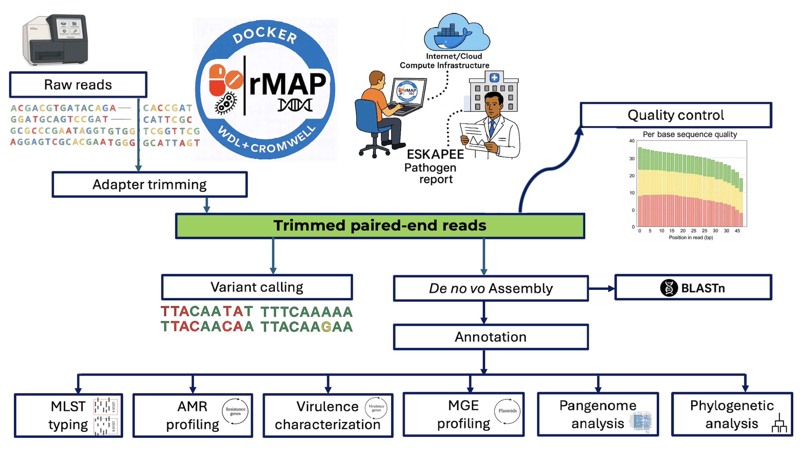

# rMAP-2.0
This modular tool provides a ready-to-use environment for rMAP, a bioinformatics pipeline for analyzing microbial genomic data &amp; profiling AMR, Mobilome &amp; Virulome. It includes all required tools &amp; dependencies, enabling reproducible, scalable analysis of NGS data in research &amp; public health settings.


**rMAP** is a fully automated pipeline for profiling the resistome & other genomic features of ESKAPEE (*Enterococcus faecium*, *Staphylococcus aureus*, *Klebsiella pneumoniae*, *Acinetobacter baumannii*, *Pseudomonas aeruginosa*, *Enterobacter* species & *Escherichia coli*) pathogens using whole-genome sequencing (WGS) paired-end reads.

---
## Overview
**Version:** 1.0  
**Pipeline Type:** WDL-based, Docker-enabled  
**Workflow Engine:** Cromwell

**rMAP-WDL-Cromwell-Docker** is a containerized, modular & scalable workflow for microbial genomics that integrates trimming, quality control, *de novo* assembly, annotation, variant calling, MLST typing, AMR profiling, mobile genetic element analysis, pangenome analysis, phylogeny & tree visualization.

This pipeline is written in **Workflow Description Language (WDL)**, utilizes **Docker containers** for tool standardization & is designed to run on the **Cromwell execution engine**.

## Features

- Adapter trimming with **Trimmomatic**  
- Quality control using **FastQC** & **MultiQC**  
- Genome assembly using **MEGAHIT**  
- Genome annotation with **Prokka**  
- Variant calling using **Snippy**  
- **MLST** profiling for sequence typing  
- **Roary** for pangenome construction  
- Phylogenetic inference using **FastTree**  
- AMR, virulence, & MGE detection with **Abricate**  
- Sequence similarity search using **BLAST**  
- Phylogenetic tree visualization with **ETE3**
- Generation of a consolidated interactive **HTML report** summarizing all key outputs  


---

## Requirements
- [**Cromwell** (v84 or newer)](https://github.com/broadinstitute/cromwell/releases)
- [**Docker**](https://www.docker.com/) installed & running
- Input data: Paired-end FASTQ files
- Reference genome (FASTA)
- Adapter sequence file (FASTA or TXT)

---



## How to download & run

### Step 1: Clone the repository
```bash
git clone https://github.com/gmboowa/rMAP-2.0.git
cd rMAP-2.0
```

### Step 2: Prepare inputs

Edit the input JSON file (e.g., `inputs.json`) with paths to your:
- Paired-end reads
- [**Reference genome**](https://www.ncbi.nlm.nih.gov/datasets/genome/)
- Illumina Adapter file
- Flags for toggling steps (true/false)

---
### Step 3: Run the workflow


## Run the command

```bash
java -jar cromwell.jar run rMAP.wdl --inputs inputs.json
```

To run on a backend like SLURM or Google Cloud, configure `cromwell.conf` accordingly.

---
### Note on pangenome & phylogenetic tree construction

- Pangenome analysis (Roary): Requires at least 3 annotated genome assemblies (in GFF3 format) for meaningful core/accessory genome separation.

- Phylogenetic tree construction (FastTree): Minimum of 4 samples is recommended to create a useful & interpretable tree. With fewer genomes, tree resolution & branching may be trivial or misleading.
  
- After running this tool on *Klebsiella pneumoniae* & *Escherichia coli*, proceed to analyze the assembled genomes using [`kleborate_wf.wdl`](https://github.com/gmboowa/kleborate_wf.wdl) to enable comprehensive genomic characterization.


---

## Output structure

- `trimmed/` – Trimmed FASTQ files  
- `qc_reports/` – FastQC and MultiQC reports  
- `assembly/` – Final contigs from MEGAHIT  
- `annotation_results/` – Prokka annotation files (`*.gff`, `*.gbk`)  
- `mlst_results/` – MLST profiles (`*.tsv`, `*.txt`)  
- `variants/` – Variant calls in VCF format from Snippy  
- `amr_results/` – Antimicrobial resistance gene matches  
- `mge_results/` – Mobile genetic element predictions  
- `virulence_results/` – Virulence gene predictions  
- `pangenome_results/` – Roary output files including `gene_presence_absence.csv` and `core_gene_alignment.aln`  
- `phylogeny_results/` – Newick tree files (`*.nwk`) and PDFs of core/accessory trees  
- `blast_results/` – Top BLAST hits in XML and TSV formats  
- `tree_visualization/` – Tree image visualizations from ETE3 (`*.png`)  
- `merged_reports/` – Final summary report (`index.html`), logs, & combined tables  


---

## Sample input JSON

Validate your JSON at: 'https://jsonlint.com/'

```json
{
  "rMAP.input_reads": [
    "~/A55738_1.fastq.gz",
    "~/A55738_2.fastq.gz",
    "~/A55870_1.fastq.gz",
    "~/A55870_2.fastq.gz",
    "~/A55888_1.fastq.gz",
    "~/A55888_2.fastq.gz",
    "~/A55944_1.fastq.gz",
    "~/A55944_2.fastq.gz",
    "~/A55727_1.fastq.gz",
    "~/A55727_2.fastq.gz"
 ],
  "rMAP.adapters": "~/adapters.fa",
  "rMAP.reference_genome": "~/GCA_000016305.1.gbk",
  "rMAP.do_trimming": true,
  "rMAP.do_quality_control": true,
  "rMAP.do_assembly": true,
  "rMAP.do_variant_calling": true,
  "rMAP.do_annotation": true,
  "rMAP.do_amr_profiling": true,
  "rMAP.do_mlst": true,
  "rMAP.do_pangenome": true,
  "rMAP.do_phylogeny": true,
  "rMAP.do_mge_analysis": true,
  "rMAP.do_reporting": true,
  "rMAP.do_blast": true,
  "rMAP.use_local_blast": true,
  "rMAP.local_blast_db": "~/refseq/bacteria/eskapee_combined.fasta",
  "rMAP.local_amr_db": "~/abricate/db/resfinder_db/resfinder.fa",
  "rMAP.local_mge_db": "~/abricate/db/plasmidfinder/plasmidfinder.fa",
  "rMAP.local_virulence_db": "~/abricate/db/vfdb/vfdb.fa",
  "rMAP.blast_db": "nt",
  "rMAP.blast_max_target_seqs": 250,
  "rMAP.blast_evalue": 0.000001,
  "rMAP.blast_min_contig_length": 300,
  "rMAP.virulence_db": "vfdb",
  "rMAP.virulence_min_cov": 60,
  "rMAP.virulence_min_id": 80.0,
  "rMAP.phylogeny_model": "-nt -gtr",
  "rMAP.reference_type": "genbank",
  "rMAP.max_cpus": 8,
  "rMAP.max_memory_gb": 16
}

```

---

## Tools used (with Docker images)

| Step                | Tool          | Docker image                          |
|---------------------|---------------|----------------------------------------|
| Trimming            | Trimmomatic   | `staphb/trimmomatic:0.39`             |
| QC                  | FastQC        | `staphb/fastqc:0.11.9`                |
| Assembly            | Megahit       | `quay.io/biocontainers/megahit:1.2.9--h5ca1c30_6` |
| Annotation          | Prokka        | `staphb/prokka:1.14.6`                |
| Variant Calling     | Snippy        | `staphb/snippy:4.6.0`                 |
| MLST                | MLST          | `staphb/mlst:2.19.0`                  |
| Pangenome           | Roary         | `staphb/roary:3.13.0`                 |
| Phylogeny           | FastTree      | `staphb/fasttree:2.1.11`              |
| Tree Visualization  | ETE3          | `gmboowa/ete3-render:1.14`            |
| AMR Profiling       | Abricate      | `staphb/abricate:1.0.0`               |
| MGE Analysis        | Abricate      | `staphb/abricate:latest`              |
| Virulence Analysis  | Abricate      | `staphb/abricate:latest`              |
| BLAST               | BLAST+        | `gmboowa/blast-analysis:1.9.3`        |

---


## Output directory hierarchy for rMAP 2.0 Pipeline

After successful execution of the `rMAP` pipeline using WDL + Cromwell + Docker, your output directory will contain subdirectories corresponding to each major analysis module. Below is the typical hierarchy:

```bash

rMAP_outputs/
├── call-CONFIGURATION/
├── call-TRIMMING/
├── call-QUALITY_CONTROL/
├── call-ASSEMBLY/
├── call-VARIANT_CALLING/
├── call-AMR_PROFILING/
├── call-MLST/
├── call-MGE_ANALYSIS/
├── call-VIRULENCE_ANALYSIS/
├── call-ANNOTATION/
├── call-BLAST_ANALYSIS/
├── call-PANGENOME/
├── call-ACCESSORY_PHYLOGENY/
├── call-CORE_PHYLOGENY/
├── call-TREE_VISUALIZATION/
├── call-MERGE_REPORTS/ 
```
Each `call-*` directory contains:
- `execution/` – Shell scripts & logs for the task.
- `stdout` / `stderr` – Standard output & error logs.
- `rc` – Return code for the task.
- Output files generated by the task (e.g., `.fasta`, `.vcf`, `.tsv`, `.json`, `.html`, etc.).

## Example Outputs by Module

| Module                | Key output files                                                                                                                                                       |
| --------------------- | ---------------------------------------------------------------------------------------------------------------------------------------------------------------------- |
| `TRIMMING`            | Trimmed FASTQ files (`*.fastq.gz`)                                                                                                                                     |
| `QUALITY_CONTROL`     | MultiQC reports, FastQC files (`*.zip`, `*.html`)                                                                                                                      |
| `ASSEMBLY`            | Assembled contigs (`*.fasta`)                                                                                                                                          |
| `VARIANT_CALLING`     | VCF files (`*.vcf`)                                                                                                                                                    |
| `AMR_PROFILING`       | Resistance profiles (`*.txt`, `*.tsv`)                                                                                                                                 |
| `MLST`                | MLST profiles (`*.txt`, `*.tsv`)                                                                                                                                       |
| `MGE_ANALYSIS`        | Mobile genetic element annotations (`*.txt`, `*.tsv`)                                                                                                                  |
| `VIRULENCE_ANALYSIS`  | Virulence gene predictions (`*.txt`, `*.tsv`)                                                                                                                          |
| `ANNOTATION`          | Genomic feature annotations (`*.gff`, `*.gbk`)                                                                                                                         |
| `BLAST_ANALYSIS`      | Top BLAST hits (`*.tsv`, `*.xml`)                                                                                                                                      |
| `PANGENOME`           | Roary outputs: `gene_presence_absence.csv`, `core_gene_alignment.aln`                                                                                                  |
| `ACCESSORY_PHYLOGENY` | Phylogenetic tree for accessory genes (`*.nwk`, `*.pdf`)                                                                                                               |
| `CORE_PHYLOGENY`      | Core genome tree & alignment files (`*.nwk`, `*.pdf`)                                                                                                                  |
| `TREE_VISUALIZATION`  | Tree visualization using ETE3 and Python3 (`*.png`)                                                                                                                    |
| `MERGE_REPORTS`       | Consolidated report (`final_report.html`), assets (`assets/*`), combined summaries (`*.tsv`, `*.csv`), pipeline summary (`pipeline_summary.json`)|

## Note on BLAST usage
If you are analyzing many samples, we recommend setting up a local BLAST nucleotide database specifically for ESKAPEE pathogens. This setup requires approximately 70 GB of disk space.
Please note that NCBI imposes usage limits on BLAST queries from a single IP address, which may affect performance or availability during high-throughput runs. A local database ensures speed, reproducibility & compliance with query limits.

If you're interested in using a local ESKAPEE database, first download and prepare your combined FASTA file, and then index it using the command below:


## Minimum sample requirements

### Important analysis prerequisites

Certain analysis modules require minimum sample numbers to function properly:

| Analysis module         | Minimum samples | Required For                     | JSON Parameter to disable          |
|-------------------------|-----------------|----------------------------------|------------------------------------|
| **Phylogenetic analysis** (Core/Accessory) | 4 | Meaningful tree topology & bootstrap support | `"rMAP.do_phylogeny": false` |
| **Pangenome analysis**  | 2               | Genome comparisons               | `"rMAP.do_pangenome": false`       |

### Configuration guidance

```json
// For datasets with <4 samples:
{
  "rMAP.do_phylogeny": false,
  // Other parameters...
}

// For single-sample analyses:
{
  "rMAP.do_pangenome": false,
  "rMAP.do_phylogeny": false,
  // Other parameters...
}

```

### Building a Local ESKAPEE BLAST database from RefSeq

This repository includes a pre-built `eskapee_db.tar.gz` archive available for direct download, which can be extracted & indexed for immediate use.

Alternatively, you can follow the steps below to download and build a local BLAST database for the ESKAPEE pathogens using RefSeq data.

---

### Step 1: Create a working directory

```bash
mkdir -p ~/refseq/bacteria/eskapee
cd ~/refseq/bacteria/eskapee
```

---

### Step 2: Use `ncbi-genome-download` (Recommended)

Install the tool if not already installed:

```bash
pip install ncbi-genome-download
```

Then run the following command to download complete RefSeq genomes for the 7 ESKAPEE species:

```bash
ncbi-genome-download bacteria \
>     --genera "Escherichia,Klebsiella,Enterobacter,Acinetobacter,Pseudomonas,Staphylococcus,Enterococcus" \
>     --formats fasta \
>     --assembly-level complete \
>     --section refseq \
>     --output-folder eskapee_genomes

```
### Step 3: Combine all Fasta files into one file

```bash

find refseq/bacteria/ -name "*.fna.gz" | xargs cat > eskapee_combined.fasta.gz      OR 

for f in refseq/bacteria/GCF*/*.fna.gz; do cat "$f" >> eskapee_combined.fasta.gz; done 

gunzip eskapee_combined.fasta.gz

```

---

### Step 4: Create the BLAST database


```bash

makeblastdb -in ~/refseq/bacteria/eskapee_combined.fasta -dbtype nucl -parse_seqids -title "ESKAPEE_DB"

```

## Note on MLST Schemas
If you are performing MLST typing across many samples, we recommend downloading & setting up the publicly available PubMLST schemes locally. This setup requires approximately 2 GB of disk space. A local installation ensures faster typing, avoids dependency on internet connectivity & supports reproducible & scalable analysis across multiple species.

## Indexing custom BLAST databases

Before running rMAP v2.0, if you intend to use local databases, make sure to index the custom nucleotide FASTA files used for resistance, plasmid & virulence factor detection using `makeblastdb`. This step is necessary to enable local BLAST searches during the workflow. For each database file, run the following command to generate the required BLAST index files:


```bash
makeblastdb -in resfinder.fa -dbtype nucl
makeblastdb -in plasmidfinder.fa -dbtype nucl
makeblastdb -in vfdb.fa -dbtype nucl

```

## Authors & contributors

- [Gerald Mboowa](https://github.com/gmboowa)
- [Ivan Sserwadda](https://github.com/GunzIvan28)
- [Stephen Kanyerezi](https://github.com/Kanyerezi30)


## Resources

- GitHub: [https://github.com/GunzIvan28/rMAP](https://github.com/GunzIvan28/rMAP)
- Publication: rMAP: the Rapid Microbial Analysis Pipeline for ESKAPE bacterial group whole-genome sequence data  
*Published in [Microbial Genomics](https://www.microbiologyresearch.org/content/journal/mgen/10.1099/mgen.0.000583)*
- The philosophy of **rMAP-WDL-Cromwell-Docker** is built on the foundation of already pre-existing tools. As a token of gratitude to the authors of those numerous tools.
---

## License

This project is licensed under the MIT License. 

## To report bugs, ask questions or seek help

The software developing team works round the clock to ensure the bugs within the tool are captured & fixed. For support or any inquiry: You can submit your query using the [Issue Tracker](https://github.com/gmboowa/rMAP-WDL-Cromwell-Docker/issues)

